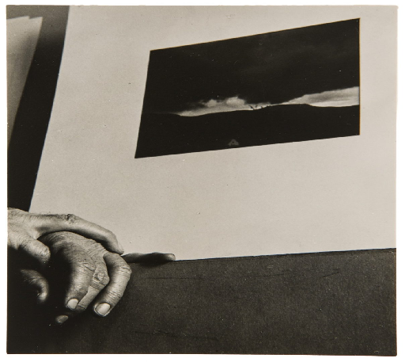

I remember her hand. She remembered to reach for mine.

My memories of Silversprings are flattened, intentionally. Squashed into dimly-lit impressions: cream walls, vaguely infantilising purples, lingering ammonia. They tried. You can't say they didn't try. Making a home where there are locks on every door is no mean feat.

There were small moments, though, that were able to pull you out. Mama needed a hand. After all, hers was a life thrust into unfamiliar ones: hands to dress, feed, guide her down the hall. Mostly, though, she needed to take one herself. To hold it. I felt a muffled thrill whenever she reached for mine, an act I could never quite predict but assigned all sorts of meaning to. Dementia is a masterclass in looking for signs. We performed a kind of pareidolia, moulding affection from instinct. Whether she knew whose hand she reached for seemed irrelevant when she reached for one anyway.

Dorothy Norman (American, 1905–1997), <em>Alfred Stieglitz's Hands Beside His Photograph</em>, c. 1930.

Hands are held in all sorts of hopeless places. Hannah La Follette Ryan is the photographer behind [*subwayhands*](https://www.instagram.com/subwayhands/), an Instagram account that feels like a relic of the app in 2015. It does exactly what it says on the tin. Hundreds of hands. On the subway. Hands holding lipsticks and lilies, pets, paperbacks, slingbacks. And, overwhelmingly, hands holding hands.

The photos are posted with no context, cropped to exclude everything but a bit of trouser leg or a square of speckled lino. Perhaps that's why the images are so addictive. It's impossible to resist drawing stories from them, putting yourself in them. They are perfectly ordinary. The first time I came across the page I cried–this sounds dramatic until you've spent a few weeks around me–and immediately chronicled my find, adding it to my illuminatingly-titled folder, *Things That Made Me Cry*. This happens a lot, but it's still a useful barometer for what moves me. I soon became curious as to why a stranger's hand on public transport could carry such emotional weight.

I am as overly sensitive as hands themselves, perhaps. I often think of the strange figure I was shown in first-year neuroscience; a spindly thing with swollen lips and enormous, dripping hands. The features of the cortical homunculus represent the outsized proportion of our somatosensory cortex devoted to processing sensory information from these areas. [Touch is the first sense to develop](https://doi.org/10.1016/bs.acdb.2016.12.002), with certain somatosensory receptors developing at just 4-7 weeks of gestation. Once we are born, we arrive with a grasp reflex, curling our fingers around anything that hits the palm. So perhaps my reaction to *subwayhands* was more instinctive than anything else, tugging at some buried memory of bean-like fingers clutching a shirtsleeve.

Holding someone's hand feels starkly human. Perhaps more stark, given the times. Our idea of connection was so warped during the pandemic that a *subwayhands* submission might have made me squirm rather than well up. But also, for years we were taught that what made us different lay in our prefrontal cortex–our reasoning, language, and intellect. It is dizzying how quickly that sense of uniqueness has slipped, if we ever had it. Admittedly, I've been searching for hints of something uniquely human as a balm against creeping existential anxieties. I think I set out to make the case, our connection to each other, our touch, our way of feeling through the world was our differentiator. Hands seemed to guide me towards that idea. However, as I began flirting with embodied AI, AGI, robotics, and our tendency to start slouching towards human exceptionalism, this piece morphed into something else.

Frankly, and I'm going to hold your hand when I say this, I don't think we can be sure that anything about us is inherently immune to replication.

I don't think this makes us any less remarkable, though. In fact, [a researcher from the Oxford Robotics](https://eng.ox.ac.uk/news/the-science-of-human-touch-and-why-it-s-so-hard-to-replicate-in-robots) Institute wrote how working on artificial skin 'forced [her] to confront just how astonishingly complicated human touch really is.' For a little while, AI struggled to generate images of hands. However brief, perhaps those 6-pronged, mangled-looking things were a reminder that they are rather intricate, often quite elegant structures. That they still are, even though generative AI has moved onto bigger things. It's a bit glib, but I do think it's possible to put our egos aside and simultaneously see something special in our repeatable, ordinary forms. Maybe, like reading into my grandma's grasp, that is wishful thinking. Maybe it's irrelevant, if you're reaching for a hand anyway.
